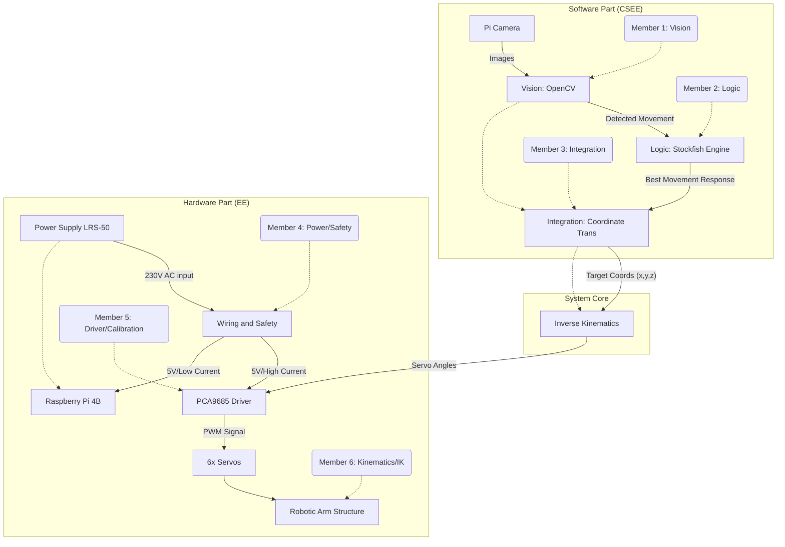
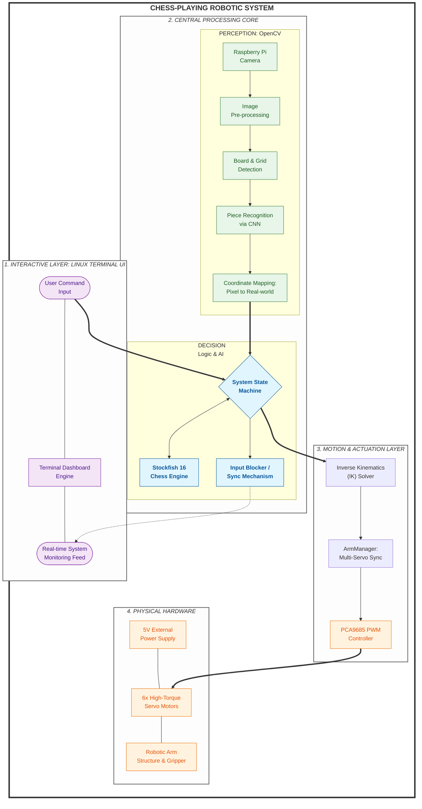

# Logbook Group21

**Project: Chess-Playing Robotic Arm**

|Members| ID |
|---|---|
|Ben Hollington|201854508|
|Junyi Li|201779164|
|Kieran Fong|201786454|
|Mohamed Hegazy|201825978|
|Mochi Pan|201779181|
|Weican Hong|201779177|

**Main Hardware Components:**

- Joy-it Robot Arm Kit 360 ([Url](https://www.rapidonline.com/joy-it-robotic-arm-kit-360-turnable-compatable-with-arduino-and-raspberry-pi-00-0809))
- Raspberry Pi 4B (8G) ([Url](https://uk.rs-online.com/web/p/raspberry-pi/1822098?gb=a))
- Adafruit 16-Channel PWM Driver ([Url](https://thepihut.com/products/adafruit-16-channel-12-bit-pwm-servo-driver-i2c-interface-pca9685))
- Pi Camera ([Url](https://www.rapidonline.com/raspberry-pi-sc1224-camera-module-3-wide-angle-lens-75-1238))

## Project Structure Overview

## Week 1

### Finished
1. **Hardware Inventory & Validation**
    - Component Verification: Received all project components, including the Joy-it robotic arm kit, PCA9685 servo driver, and Raspberry Pi.
    - Integrity Check: Performed visual inspections and basic power-on tests to verify the integrity and functionality of all electronic modules.
2. **Mechanical Assembly & Actuator Calibration** (B.H. K.F. M.H. M.P.)
    - Structural Assembly: Completed the physical build of the robotic arm according to technical specifications.
    - Servo Zeroing: Manually calibrated and zeroed all servos before final installation to ensure a consistent coordinate system.
    - Hardware Integration: Soldered the header pins onto the PCA9685 PWM driver and established connections between the servos and the Raspberry Pi.
    - Custom Design: Drafted and prototyped a custom mounting solution for the Raspberry Pi Camera Module to ensure an optimal overhead view of the chessboard.
    - Reliability Testing: Conducted iterative movement checks to ensure mechanical stability and clear range of motion for each joint.
3. **Computing Environment Configuration** (M.P. J.L.)
    - OS & Remote Access: Initialized the Raspberry Pi OS and configured VNC/SSH for headless remote operation.
    - Environment Setup: Installed essential Python libraries and dependencies for GPIO control and I2C communication.
    - Hardware Interfacing: Enabled the CSI camera interface and I2C ports; configured user permissions for hardware access.
    - Resource Validation: Verified that the system correctly identifies the PCA9685 and the camera feed.
4. **Chess Engine Deployment** (M.P. W.H.)
    - Local Installation: Deployed the Stockfish chess engine onto the Raspberry Pi.
    - Performance Benchmarking: Executed stress tests and depth-analysis trials to ensure the engine runs efficiently on ARM architecture without overheating or latency issues.
    - Functional Verification: Confirmed the engine correctly processes FEN strings and returns valid move suggestions via the command line.
5. **System Design & Software Architecture**
    - Hardware Optimization: Refined the overall hardware design based on assembly findings, specifically improving cable management and power distribution.
    - Software Framework: Developed the preliminary software architecture, defining the interfaces between the vision module (input), the chess engine (logic), and the servo controller (output).
    - API Definition: Drafted initial API endpoints for the "Move Execution" and "Board Recognition" modules.

### Plan for Week 2

1. Complete basic build of hardware. (B.H. K.F. M.H.)
2. Hang the camera to a suitable position. (K.F.)
3. Pick something up and put things down. (M.P.)
4. Detect the chessboard and know where each pieces located. (J.L.)
5. Basically complete the logic processing. (W.H.)

## Week 2

* Turn to Lab room 302A for the power supply.

### Finished

1. **Structural Completion** (M.H. K.F.)
   - Finalized the physical build by securely mounting the microcontroller and driver boards to the robotic arm base for improved stability.
   - Planned and executed a systematic wiring layout to ensure no cable interference during high-degree-of-freedom maneuvers.
2. **CAD Design** (K.F.)
   - Completed the 3D CAD modeling for a camera bracket; design files have been exported and sent for laser cutting.
3. **Kinematics Solving** (M.P.)
   - Inverse Kinematics (IK) Solving: Developed and verified the IK solver to translate target Cartesian coordinates into precise joint angles for the 4-axis system. `IK.py` *(Further testing needed)*
   - Multi-Servo Synchronization: Developed a driver `ArmManager.py` to facilitate simultaneous movement of all six servos, replacing sequential movement with fluid, synchronized trajectories.
   - Programmed and tested the gripper actuation sequences for chess piece handling. *(Further testing needed)*
4. **Computer Vision & Coordinate Mapping** (J.L.)
   - Chessboard Detection: Implemented image processing algorithms to detect board boundaries and map them to a localized coordinate system.
   - Data Logging: Developed an automated feature to capture and save processed images for debugging and verification of the board state recognition.
5. **System Logic** (W.H.)
   - AI Module Integration: Successfully integrated the AI decision-making module (Stockfish) with the hardware control loop to enable full "perception-to-action" executability. *(Further testing needed)*
   - Concurrency & Robustness: * Identified a critical logic error where asynchronous user inputs (e.g., pressing 'Enter' during actuation) caused state desynchronization. Resolved this by implementing a Status Check/Blocking Mechanism that prevents input processing while the arm is in motion. This ensures the system maintains a consistent state and prevents invalid move calculations.

### Plan for Week 3

1. Further testing Kinematics and . (M.P.)
2. Vision detects which piece and where it is located. (J.L.)
3. Develop the main part: `main.py` (M.P. W.H. J.L.)
4. Start to deal with the poster.(B.H. M.H. K.F.)

## Week 3

### Finished

1. **Poster Production** (B.H. M.H. K.F.)
   - Initiated the design phase for the project poster; drafted the layout and technical diagrams showcasing the system architecture.
2. **Logic** (W.H.)
   - Completed the core logic algorithm and successfully passed the main.py compatibility tests, ensuring seamless communication between the decision-making engine and hardware calls.
3. **Kinematics & Motion Optimization** (M.P.)
   - Finalized the software implementation for the Kinematics module.
   - Successfully passed suitability tests, verifying that the arm can reach target coordinates with the required precision for chessboard grid spacing.
4. **Hardware Refinement** (K.F.)
   - Integrated the Raspberry Pi camera extension cable.
   - Mounted the camera to its finalized position on a metal stand with a test tube clamp, optimizing the Field of View (FOV) for complete board coverage. (The 3D-printed bracket has been denied, we use a metal stand with a test tube clamp instead.)
5. **Vision Training & Dataset Collection** (J.L. M.P.)
   - Collected a comprehensive dataset of chessboard and piece images under lab lighting conditions.
   - Commenced training and debugging of the OpenCV-based detection algorithm for real-time piece identification and coordinate localization.
6. **User Interface Development** (M.P. W.H.)
   - Designed and initiated the coding of a Linux terminal-based interface to provide a real-time dashboard.

###  Plan for Week 4

1. System-Wide Integration (main.py) (M.P. W.H. J.L.)
2. Vision Localization Calibration (J.L. M.P.)
3. TUI Refinement & UX Polishing (M.P. W.H.)
4. Poster Finalization (B.H. M.H. K.F.)

## Week 4

### Finished

1. **Poster Finished** (B.H. M.H. K.F. W.H.)
   - Finalized the project poster design, including high-resolution system architecture diagrams and performance metrics. Sent for printing.
   - Completed and published the final Weblog, documenting the entire development process from hardware assembly to software integration.
2. **User Interface Completed** (M.P. W.H.)
   - Finalized the core execution loop in `main.py`.
   - Completed the Linux Terminal UI (TUI) dashboard, featuring real-time system status and move logging.
3. **Contingency Development: Manual Mode Implementation** (M.P. J.L.) (Plan B)
   - Issue Identified: Detected low accuracy in the initial chessboard vision recognition, preventing stable entry into the main dashboard during automated initialization.
   - Pivot: Initiated the development of a "Manual Mode" to bypass vision-dependent initialization. This mode allows users to input moves directly into the TUI, ensuring the system remains functional for the final demonstration regardless of ambient lighting or vision constraints.
4. **Hardware Stability Check** (K.F.)
   - Conducted a final physical audit of the robotic arm; secured all 3D-printed components and verified cable clearances for the full range of motion.

### Plan for Week 5

1. Complete Manual Mode (M.P.)
2. Bench Inspection Preparation
3. Collect the poster (M.H.)
4. Sustainability Report Writing (B.H. leading)
5. Vision Debugging (J.L.)
