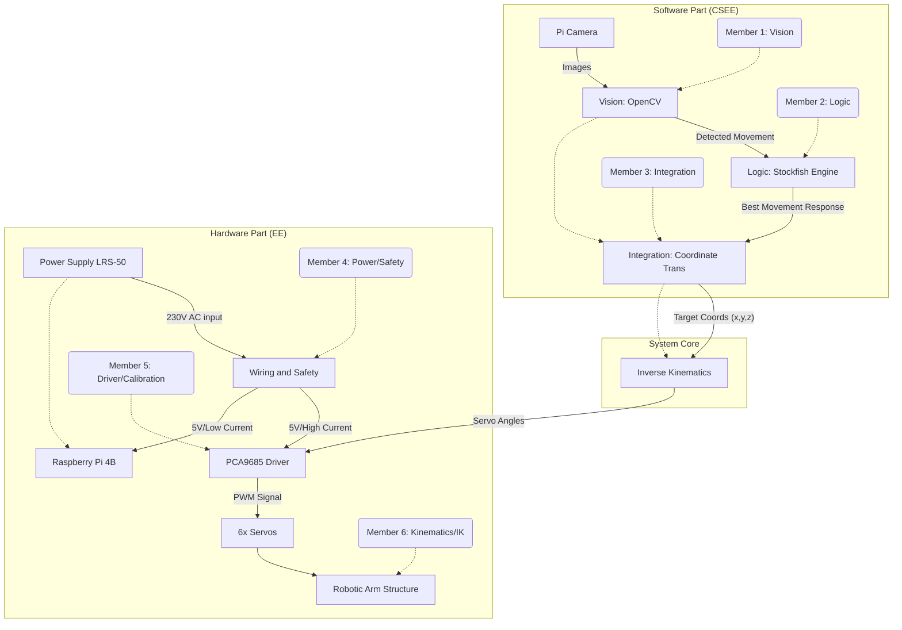
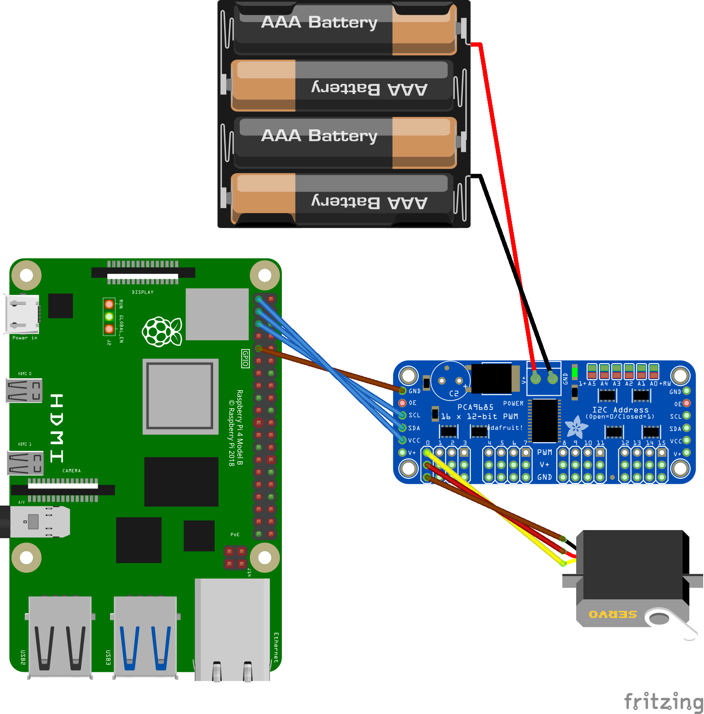

# Chess-Playing Robotic Arm

**Main Hardware Components:**

- Joy-it Robot Arm Kit 360 [Url](https://www.rapidonline.com/joy-it-robotic-arm-kit-360-turnable-compatable-with-arduino-and-raspberry-pi-00-0809)
- Raspberry Pi 4B (8G) [Url](https://uk.rs-online.com/web/p/raspberry-pi/1822098?gb=a)
- Adafruit 16-Channel PWM Driver [Url](https://thepihut.com/products/adafruit-16-channel-12-bit-pwm-servo-driver-i2c-interface-pca9685)
- Pi Camera [Url](https://www.rapidonline.com/raspberry-pi-sc1224-camera-module-3-wide-angle-lens-75-1238)
- LRS-50 Power Supply [Url](https://www.rapidonline.com/mean-well-lrs-50-5-smpsu-low-profile-5v-10a-50w-en60335-1-compliance-05-1085) (request denied)

## Project Structure Overview

## Pre-Project Tasks

### To All

- Read the instructions of all the components, and understand the main function.
- Thinking of what component needs to add.
- Install a visual machine of Debian linux / Ubuntu linux on own computer.
- Learn basic linux operating logic (At least know how to use linux-based system).
- Learn basic Python commands
- Learn and install git.
- Learn basic rules of chess.
- Learn the symbol representation method for the movement of chess pieces.

### Software Part

#### Member 1: Vision
- Study to use opencv as more as possible.
- Search for open-source code for identifying the chessboard and chess pieces.
- Design a coordinate mapping algorithm (Get from CV --> 3D, Get from CV --> Chess symbol representation).

#### Member 2: Logic
- Study Forsyth-Edwards Notation
- Test usability of stockfish (a Python Library).
- Design game logic and game states.

#### Member 3: Integration
- Learn how to do Threading using python.
- Defining interfaces.
- Learn how to initialize the Raspberry Pi system and how to manage it.
- Learn how to set SSH and VNC.

### Hardware Part

#### Member 4: Power/Safety

- Read the instructions of all the components, take notes of the power demand(Current and Voltage).
- Study to use CAD software basically (AutoCAD, EasyEDA ...).
- Complete the design graph for the overall wire connection using CAD software.
  - If it takes too much time to learn the software, please ensure there is a hand-draw graph before week 1.
- Implement an emergency stop mechanism if possible.

#### Member 5: Driver/Calibration

- Take a deep learning of *Adafruit 16-Channel PWM Driver*.
- Understand the Communication Protocol: I2C
- Understand the Control Signal: PWM (Pulse Width Modulation)
- Study the Python Libraries that use to control hardware movements.
- Write a basic Python demo try to control an servo.

#### Member 6: Kinematics/IK

- Think of the 3D geometric relationship among the size of components of the arm, angles and 3D coordinates.
- Know how to complete URDF files.
- Study Python Libraries `ikpy`. (I don't know if this is good to use).
- Learn 3D modeling software (Solidworks...) if possible.
- Try to design the overall structure and appearance using 3D modeling software.

## Wire instruction

